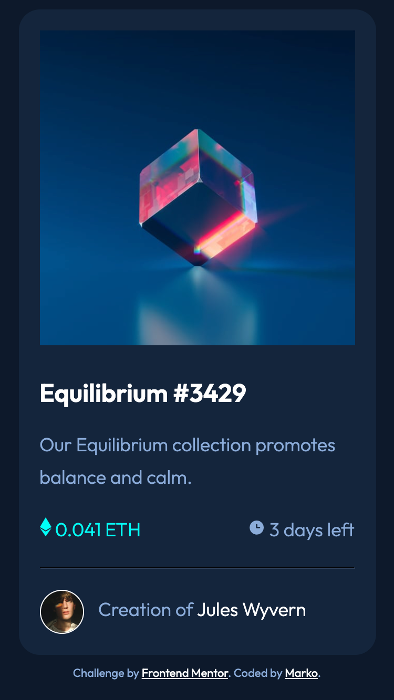
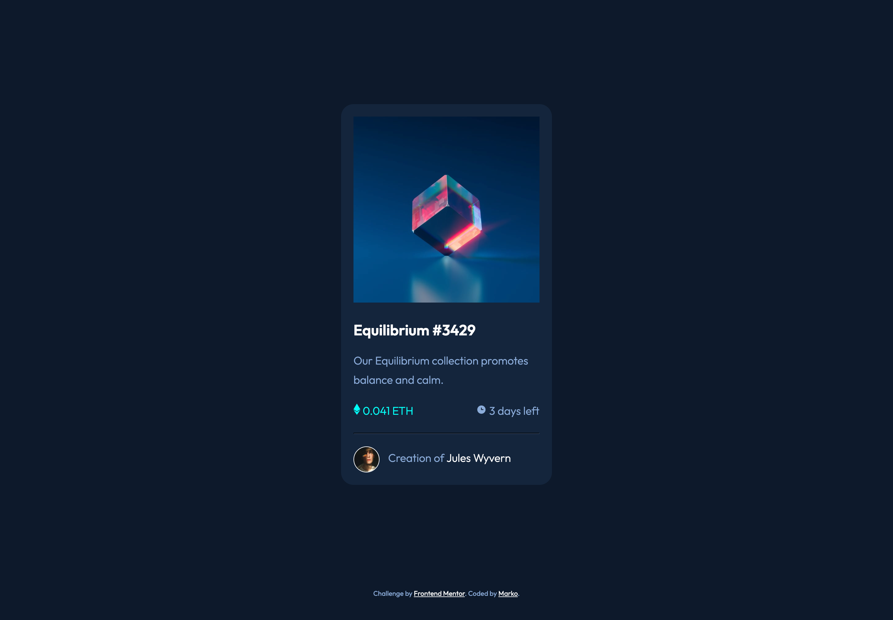

# Frontend Mentor - NFT preview card component solution

This is a solution to the [NFT preview card component challenge on Frontend Mentor](https://www.frontendmentor.io/challenges/nft-preview-card-component-SbdUL_w0U). Frontend Mentor challenges help you improve your coding skills by building realistic projects. 

## Table of contents

- [Overview](#overview)
  - [The challenge](#the-challenge)
  - [Screenshot](#screenshot)
  - [Links](#links)
- [My process](#my-process)
  - [Built with](#built-with)
  - [What I learned](#what-i-learned)
  - [Continued development](#continued-development)
  - [Useful resources](#useful-resources)
- [Author](#author)


## Overview

### The challenge

Users should be able to:

- View the optimal layout depending on their device's screen size
- See hover states for interactive elements

### Screenshot






### Links

- Solution URL: [Add solution URL here](https://your-solution-url.com)
- Live Site URL: [view site](https://smarko-web.github.io/nft_preview_card_component_main/)

## My process

### Built with

- Semantic HTML5 markup
- CSS custom properties
- Flexbox
- Mobile-first workflow

### What I learned

Use this section to recap over some of your major learnings while working through this project. Writing these out and providing code samples of areas you want to highlight is a great way to reinforce your own knowledge.

To see how you can add code snippets, see below:

```css
.overlay {
    position: absolute;
    opacity: 0;
    height: 100%;
    width: 100%;
    top: 0;
    height: 100%;
    width: 100%;
    background-color: var(--Cyan);
}
.overlay:hover {
    opacity: .5;
    cursor: pointer;
    transition: var(--transtime) all ease-in-out;
}
.overlay img {
    position: absolute;
    top: 50%;
    left: 50%;
    transform: translate(-50%, -50%);
    opacity: 1;
}
```

### Continued development

I would like to become more proficient in my HTML and CSS skills before I start doing more advanced web development. As I am practicing these skills, applying the prior knowledge that I have grained from YouTube and other Self paced courses, increasing confidence in web design/development.

### Useful resources

- [adding hover effect on picture](https://www.youtube.com/watch?v=exb2ab72Xhs&t=431s) - This video showed me how to add a hover effect to images. 
- [project overview](https://www.youtube.com/watch?v=88aBN3N45WA) - This video inspired me to start this project.

## Author

- Frontend Mentor - [@smarko-web](https://www.frontendmentor.io/profile/smarko-web)


